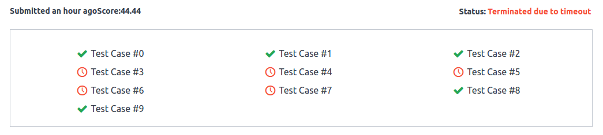

# save-humanity
Solution of save humanity hackerrank, [problem](https://www.hackerrank.com/challenges/save-humanity/problem)

To solve the problem please copy and paste the content of either Solution1 or Solution2

Considerations
n = length of pattern
m = length of text

# Solution 1
Simple matching with pattern window in text brute force 
Complexity:  
Time: O(n*m) 
Space: O(n+m)

Results 

Most of the tests where failing due to timeout so I started working in a nother solution

# Solution 2
This solution uses Z algorithm (Linear time pattern searching Algorithm) because the Z algorithm takes O(n+m) time complexity to compare two strings. So I needed to do some changes in order to make sure the Z algorithm considers the pattern matching at least with 1 char different.

So I did the Z algorithm twice, one for the text and pattern and another for the reverse of them. With two Z arrays I'm albe to figured out when the pattern matches and also when the pattern is just one char different. 

Complexiy: 
Time: O(m+n) + O(m+n) + O(n) + O(m) =  O(m+n) 
Space: O(2*(n+m)) = O(m+n)

Results 

References 
[1](http://codeforces.com/blog/entry/3107) 
[2](http://www.utdallas.edu/~besp/demo/John2010/z-algorithm.htm) 
[3](http://www.geeksforgeeks.org/z-algorithm-linear-time-pattern-searching-algorithm/) 
[4](https://www.quora.com/Find-a-pattern-in-a-string-with-one-or-zero-mismatch-Eg-S-abbbaaabbbabab-P-abab-Matches-are-abbb-index-0-aaab-index-4-abbb-index-6-abab-index-10-I-guess-it-can-be-done-by-some-modification-of-KMP-algorithm)
